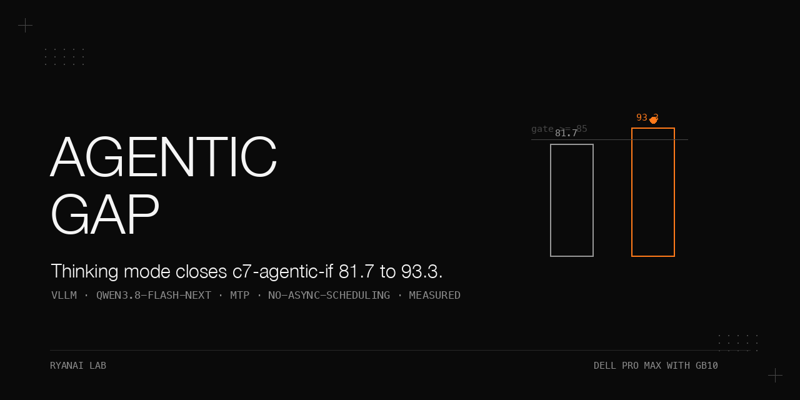

# The c7a gap narrowed in thinking mode — Qwen3.8-Flash-Next on two Dell Pro Max with GB10

> We ran a two-node Qwen3.8-Flash-Next (NF) build against our private 11-category eval bank (questions not published) under our rule-v3 adjudication and it failed exactly one gate: c7-agentic-if scored 81.7 median (runs 85.0 / 80.0 / 81.7) against the comparison model 95/95/95 with a gate of >=90. We tested four candidate fixes, of which one (thinking mode) worked: thinking mode + each vendor's official thinking sampling, taking NF to 93.3/91.7/95 (median 93.3) at passing wall clock, with the three restraint-type questions that scored zero in every non-thinking run going to full marks. The point of this cookbook is the **evidence**: the initial comparison had both models in non-thinking greedy mode, while the vendor's published agentic scores were taken in thinking mode. With thinking on for both models and each vendor's official thinking sampling, the observed c7a gap narrowed from 81.7 vs 95.0 to 93.3 vs 95.0. The thinking tiers were not equivalent, and the size of that asymmetry's effect was not measured (Limit 1). This observation does not establish full alignment with the vendor's official conditions or rule out a model-capability difference. The full thinking-mode rule-v3 table shows 11/11 gates passed for NF, subject to all three [Limits](#limits): unequal thinking tiers, missing reasoning pass-back in long-horizon coding, and an unverified timeout/throughput contribution to that category's gap. The comparison model is DeepSeek V4 Flash Vision-Exp on the same two nodes (its own speculative-decoding stack, async scheduling on); it produced zero runaway loops in 330 questions.

## Why this matters

A 13-point gap on an agentic-tool category is the kind of number that gets a model rejected. Here the initial comparison had both models in non-thinking greedy mode, while the vendor's published scores were taken in thinking mode. With thinking on for both models and each vendor's official thinking sampling, the observed c7a gap narrowed from 81.7 vs 95.0 to 93.3 vs 95.0. The thinking tiers were not equivalent, and the size of that asymmetry's effect was not measured (see Limit 1 in [Limits](#limits)).

The runaway agent loop that had once depressed this category had already been fixed with `--no-async-scheduling` before this investigation started, and the non-thinking c7a gate still failed after that fix. This cookbook records the four candidate fixes (of which one, thinking mode, worked), the parser A/B, the thinking-mode full table, the per-sub-category breakdown, the reasoning-effort ladder, and the conditions under which every number was taken.

Two things are deliberately out of scope here and live in their own cookbooks (see Related cookbooks): the 1M build recipe with the MTP-draft `max_model_len` discovery, and the async-scheduling × MTP runaway-loop isolation.

## Hardware and stack

- Two nodes, each a **Dell Pro Max with GB10** (referred to below as "head node" / "worker node").
- Serving: the community two-node cluster recipe —
  - vLLM b12x MoE backend;
  - TP2 over RoCE;
  - fp8 KV cache;
  - MTP-4 speculative decoding;
  - static YaRN factor 4 to 1M context.
  - (The 1M build recipe and the MTP-draft `max_model_len` discovery are a separate cookbook; see Related cookbooks.)
- Parser flags used here: `--tool-call-parser qwen3_coder --reasoning-parser qwen3`. Earlier runs used the cluster recipe's `qwen3_xml`; we adopted `qwen3_coder` after the parser A/B (see [Results](docs/results.md) R3).
- Evaluation harness: our private 11-category eval bank (questions not published; category names c1-kbqa ... c10-sre-ops are public in this sheet), run under rule v3 —
  - c7a median of 3 runs;
  - agentic/tool wall clock <= 1.5x baseline;
  - c7a in the critical-category set;
  - one comparison tool as the adjudicator.
  - Thinking-mode runs used `max_tokens 16384` and each vendor's official thinking sampling.
- Comparison model: DeepSeek V4 Flash Vision-Exp (DSV4F) on the same two nodes (its own speculative-decoding stack, async scheduling on); it produced zero runaway loops in 330 questions, i.e., not affected by the NF loop bug.

## Versions and images

- Community two-node recipe: `qwen3.8-flash-next-nvfp4-cluster` in github.com/eugr/spark-vllm-docker; image `vllm-node-b12x` (digest prefix `d6fb7a6a277d`).
- vLLM build: `v0.1.dev20759+gb40673cd0`.
- Weights: `local-inference-lab/Qwen3.8-Flash-Next-NVFP4` (revision not recorded).
- Driver: `580.178.04`.
- Kernel: `7.0.0-1019`.

## Reproducibility

Quality scores in this cookbook come from a private eval bank and are reported here, not reproducible by readers. The recorded configurations below document the evaluation mode, sampling and parser. The two models' thinking tiers were not equivalent (see Limit 1 in [Limits](#limits)).

Request fields used for the candidate (NF), thinking mode on: `chat_template_kwargs {"enable_thinking": true}`, reasoning effort unset (so NF's chat-template default applies: "xhigh"), `temperature 1.0`, `top_p 0.95`, `top_k 20`, `presence_penalty 0.0`, `max_tokens 16384`, served with `--tool-call-parser qwen3_coder --reasoning-parser qwen3`. For the reasoning-effort ladder (R8) low and medium were set explicitly. For the comparison model (DSV4F): `chat_template_kwargs {"thinking": true}` with reasoning effort pinned to "high", and its vendor's documented thinking sampling (values per its model card; not restated here). The 2026-09-19 DSV4F c7a thinking-mode re-runs also used "high". Model card reference: huggingface.co/Qwen/Qwen3.8-Flash-Next (revision not recorded); its footnote is quoted only as "agentic scores measured with thinking on, reasoning effort xhigh, temp 1.0 / top_p 0.95, 256K, in the vendor-named agent harness".

## Recorded evaluation sequence

These steps describe the historical runs in execution order. The eval bank and comparison tool were private components of that setup.

1. **We re-adjudicated the full rule-v3 table** (non-thinking, greedy, the runaway loop already fixed with `--no-async-scheduling`): 11-category run x 2 + c7a x 3 + performance probes for NF vs the comparison DSV4F baseline. This is the R1 headline: NF failed only c7-agentic-if; every other category passed its gate.
2. **We broke c7a down per sub-category** for that run (30 questions x 2 points = 60 max, both models, 3 runs) to locate the failure shape. The gap turned out to be mainly restraint-shaped, with the multi-step chains intact.
3. **We checked the official measurement setting**: the HF model card (huggingface.co/Qwen/Qwen3.8-Flash-Next, revision not recorded) notes that every official agentic score was measured in the vendor's agentic harness (named in the card footnote), temp 1.0 / top_p 0.95, 256K, thinking mode on by default (reasoning effort xhigh), with the official serving recipe `--tool-call-parser qwen3_coder --reasoning-parser qwen3`. Our c7a numbers were non-thinking + greedy + `qwen3_xml` — a different measurement setting.
4. **We tested four candidate fixes, each c7a x 3, with both models in the same evaluation mode per fix.** The thinking tiers were not equivalent (see Limit 1 in [Limits](#limits) and R2 in [Results](docs/results.md)):
   - restraint system prompt (three hard rules);
   - each vendor's official non-thinking sampling (DSV4F: t1.0/top_p0.95; NF: t0.7/top_p0.8/top_k20/rep_pen1.5);
   - thinking on + each vendor's official thinking sampling;
   - framework-layer tool-loop guardrails (retry-denial guard).
5. **We ran the parser A/B** (c7a x 3): `qwen3_xml` vs official `qwen3_coder`, at greedy non-thinking and at thinking + official sampling (see R3 in [Results](docs/results.md)). This isolated the parser variable from the sampling variable, which the four-candidate run had entangled. Decision: adopt `qwen3_coder`.
6. **We ran the overnight thinking-mode rule-v3 full table**: both models, thinking on + official thinking sampling + `max_tokens 16384` + `qwen3_coder` + 1M YaRN factor 4; 11 categories x 2 + c7a x 3 per model, plus a reasoning-effort ladder on c7a (see R4 and R8 in [Results](docs/results.md)). The evaluation mode was shared, but the thinking tiers were not equivalent: NF used its default "xhigh" with effort unset; DSV4F used "high". Gates in this table were recomputed from the thinking-mode baseline, not carried over from R1.
7. **We broke c7a down per sub-category** under both non-thinking and thinking (see R5 in [Results](docs/results.md)). This showed the three restraint-type questions that scored zero in every non-thinking run scoring full marks in thinking mode.

## Results

All tables, with a one-line note of the measurement conditions above each, are in [docs/results.md](docs/results.md). Headline numbers, copied unchanged with their conditions:

- **R1 (non-thinking + greedy, runaway loop already fixed):** 2 runs/category, c7a = 3 runs, both models on the same two-node engine with different speculative-decoding stacks. NF failed only c7-agentic-if — 81.7 median (runs 85.0/80.0/81.7) vs DSV4F 95/95/95, gate >=90.0. change own (common categories) +6.7. Verdict: negative result (keep status quo), only c7a failed.
- **R2 (four candidate fixes, c7a x 3, both models):** shared evaluation mode per fix, with unequal thinking tiers (see Limit 1 in [Limits](#limits)). Only thinking on + each vendor's official thinking sampling passed — NF 93.3/91.7/95 (median 93.3, wall 81-97 s), DSV4F 95/95/95 (wall 97-128 s), gate >=90 and wall clock both pass. The restraint prompt and the official non-thinking sampling both had zero median effect on NF.
- **R3 (parser A/B, c7a x 3, NF):** `qwen3_xml` vs `qwen3_coder` at greedy non-thinking and at thinking + official sampling. Decision: adopt `qwen3_coder` (equal median, smaller variance, matches official recipe).
- **R4 (thinking-mode full table):** both models thinking on, `max_tokens 16384`, `qwen3_coder`, NF at 1M YaRN factor 4. 11/11 categories passed for NF; wall 3/3; perf 4/4. change own +3.8. Verdict: candidate/win. Read together with all three [Limits](#limits): unequal thinking tiers, missing c9 reasoning pass-back, and an unverified c9 timeout/throughput contribution. c7-agentic-if 91.7 vs 90 (median of 5 runs). Tightest pass: c10 70 vs gate 66.7 (non-critical).
- **R5 (c7a per-sub-category, non-thinking):** 30 questions x 2 = 60 max, both models, 3 runs. The gap is mainly restraint-shaped (Restraint 2/4 vs 4/4, Parameter 3/6 vs 5/6, Error-Recovery 17-20/24 vs 22/24; Multi-Step Chains identical 6/6); totals 51/48/49 (NF) vs 57/57/57 (DSV4F). The three restraint-type questions that scored zero in every non-thinking run score full marks in thinking mode.
- **R7 (same questions under thinking mode):** thinking on + official thinking sampling. Thinking mode flips the three restraint-type questions that scored zero in every non-thinking run to full marks. Wall per run (serial sum of 30): NF thinking 308-364 s, DSV4F thinking 330-365 s.
- **R8 (reasoning-effort ladder, c7a x 3, NF):** thinking on + official sampling, three effort levels. On this category the three effort levels tied (91.7 median each); we chose low for the fast tier and medium for the quality tier; other categories were not re-run per effort level.

R4's thinking-mode gates were recomputed from its thinking-mode baseline (critical categories use baseline minus 5 points, other categories baseline minus 10 points), giving a c7a gate of >=85.0 in R4. R1's non-thinking c7a gate and R2's candidate-fixes c7a gate were >=90.0. own-mean = mean of the 8 non-pack categories in percentage points.

Two stated source disagreements are reproduced unchanged (not reconciled): these are different runs taken on different days; on this 30-question category one question is 3.3 points, so three-run medians can differ by 5-10 points between sessions — (i) the no-async c7a median is recorded as 91.7 in the isolation note and 81.7 in the same-condition full-table re-adjudication, and the decision used the 81.7 full-table value (R1); (ii) thinking-mode per-run wall is 81-97 s in the candidate-fixes table (R2) vs 308-364 s per run in R7.

## Limits

These three limits apply to the headline full-table claims (11/11 gates passed, own mean +3.8, c9 100 vs 82.3). The observed c7-agentic-if result remains: it failed its gate in non-thinking greedy mode (81.7 vs 95.0, gate >=90) and passed with both models in thinking mode (93.3 vs 95.0).

**Limit 1 — Thinking tiers were asymmetric.** In the full thinking-mode table, DSV4F had thinking on with reasoning effort pinned to "high", while NF had thinking on with effort unset, so NF's chat-template default applied. That default is NF's top tier ("xhigh"; supported tiers are xhigh, medium, low), per the model card and chat template. DSV4F's vendor-published evaluation setting is the top tier "max". The table therefore compares NF at its top tier with DSV4F one tier below its own top tier. The tier difference is recorded in the saved run configurations; the possible bias direction, favouring NF, is an inference. Its size on DSV4F was not measured. Running DSV4F at "max" with long generations on this stack killed the engine on 2026-09-25 (two concurrent requests, 32,768 max tokens; tensor-parallel workers hung, engine reported dead; no out-of-memory and no GPU error in the kernel logs). An earlier engine death at DSV4F "high" during a long-generation coding run on 2026-09-19 was already disclosed as "the comparison model's engine died once". On NF's own tier effect: on c7a, three runs per tier at low, medium and xhigh gave the same median (91.7 each; this is the R8 ladder already in the book). Other categories were not run per tier.

**Limit 2 — Long-horizon coding (c9) did not pass reasoning back between turns.** In the multi-turn long-horizon coding category, the harness appended assistant turns without the model's reasoning text, so each later turn was rendered with empty history thinking. Both vendors' documentation says reasoning should be kept across tool-calling turns. The harness was fixed on 2026-09-24 (reasoning is returned when the recipe asks for it); the fix was verified by prompt token counts (NF prompt grew from 82 to 269 tokens once reasoning was returned, measured once). The c9 scores in this book (NF 100.0, DSV4F 82.3) were taken on 2026-09-19, before the fix, so they were measured without passing reasoning back. The effect on those scores was not measured. Other tool-harness categories (c3, c7a, c8) were not verified against each vendor's recommendation.

**Limit 3 — The timeout component of the c9 gap was not verified.** The DSV4F c9 figure (82.3) comes from a re-run after its engine died during the first pass. That re-run had 6 items per run and scored 81.25 and 83.3, with 2 and 1 errored items respectively (an error is an HTTP error or a timeout and scores zero), wall clocks 1,020 s and 966 s; the harness did not record which errors were timeouts. An indirect result, observed once on 2026-09-26 on a single-node DSV4F setup (one GB10, different engine and quantisation), showed the same category scoring 81.2 with one item at the 900 s per-item limit, and 98.6 once the limit was doubled; the dual-node DSV4F setup scored 99.0 on that category. This suggests a throughput or timeout component in the 82.3 figure, but it was not tested on the setup used for this table, so it is an inference, not a finding. The c9 100 vs 82.3 margin should be treated as possibly including a timeout effect of unknown size; whether it includes one was not verified.

The following remain unresolved:

- The size of the thinking-tier asymmetry effect on the full table.
- The effect of missing reasoning pass-back on c9 scores for either model.
- How much of the c9 gap is timeouts or throughput.
- Whether the c3, c7a and c8 harness history handling matches what each vendor recommends.

## What did not work

- **Restraint system prompt (three hard rules):** zero effect on NF — 81.7/81.7/78.3 (median 81.7), identical to baseline non-thinking greedy 85/80/81.7 (median 81.7); on DSV4F the median was unchanged (95) with one lower run (91.7). Recorded verdict: fail.
- **Each vendor's official non-thinking sampling** (DSV4F t1.0/top_p0.95; NF t0.7/top_p0.8/top_k20/rep_pen1.5): no median improvement in three runs; larger spread — NF 76.7/81.7/85 (median 81.7, same as baseline) — and it hurt the control: DSV4F 95/81.7/88.3 (median 88.3, down from 95/95/95). Recorded verdict: fail.
- **Framework-layer tool-loop guardrails (deny-and-retry guard):** not applicable in the measured failure shape — NF produced zero engine errors and chose a *different* tool at each extra step, so retry-cap guards never triggered. Recorded verdict: fail.
- **`--no-async-scheduling` fixes the engine, not the gate:** it eliminated runaway loops (0/120; wall back to 48-52 s from 212-217 s) but the non-thinking c7a gate still failed (81.7 vs >=90), so the original negative verdict stood on c7a alone.
- **Switching adjudication basis:** the non-thinking R1 and thinking-mode R4 tables have different baseline scores and derived gates (c7a gate >=90.0 in R1 vs >=85.0 in R4). A gate pass in one table is relative to that table's baseline. The full-table comparison remains subject to all three [Limits](#limits).
- **YaRN factor 2 / KV bf16 / indexer / MTP off:** the engine-shape levers were tested in a separate A/B and are out of scope here; see `dell-pro-max-gb10-qwen3.8-flash-next-engine-ab`.

## Pitfalls

Symptom → root cause → fix → how we found it, in [docs/pitfalls.md](docs/pitfalls.md). Summary: interpreting the c7a gap without its measurement conditions; mistaking it for an engine bug; confounding parser and sampling; non-comparable wall-clock aggregations; and switching adjudication basis.

## Related cookbooks

- `dell-pro-max-gb10-qwen3.8-flash-next-1m-context` — the 1M-context build recipe and the MTP-draft `max_model_len` discovery.
- `dell-pro-max-gb10-vllm-mtp-async-runaway` — the async-scheduling × MTP runaway-loop isolation table and root-cause paragraph (the loop fixed with `--no-async-scheduling` before this investigation started).
- `dell-pro-max-gb10-qwen3.8-flash-next-engine-ab` — the engine-shape A/B (native 262K / YaRN factor 2 / KV bf16 / indexer / MTP off).

## Footnote on how the vendor measured agentic scores

The model card footnote states that every published agentic score was taken in the vendor's agentic harness (named in the card), at temp 1.0 / top_p 0.95, 256K context, with thinking on by default at reasoning effort xhigh. Our initial rule-v3 gate ran at a different setting (non-thinking, greedy, a different parser). In the local thinking-mode runs, the observed c7a gap narrowed to 93.3 vs 95.0; the thinking tiers were not equivalent, and the size of that asymmetry's effect was not measured (see Limit 1 in [Limits](#limits)).

## Files

- `README.md` — this document.
- `docs/results.md` — the R1–R8 tables, with a one-line note of the measurement conditions above each table.
- `docs/pitfalls.md` — the pitfalls expanded (symptom / root cause / fix / how we found it).
- `docs/make_banner.py` — banner generator, pure PIL (house style); change only the wordmark/tagline strings to fit this cookbook.
- `docs/assets/banner.png` — the rendered banner (generated by `docs/make_banner.py`).

## License

Apache-2.0.
